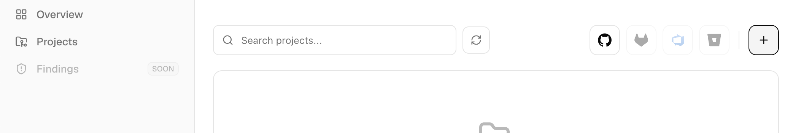
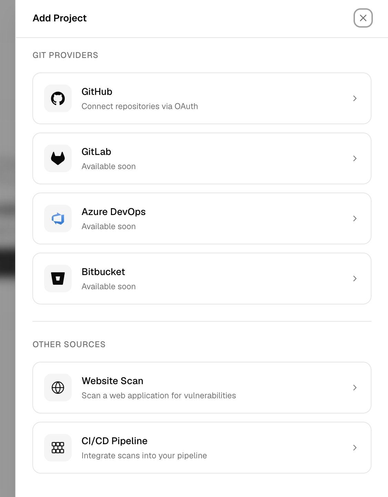
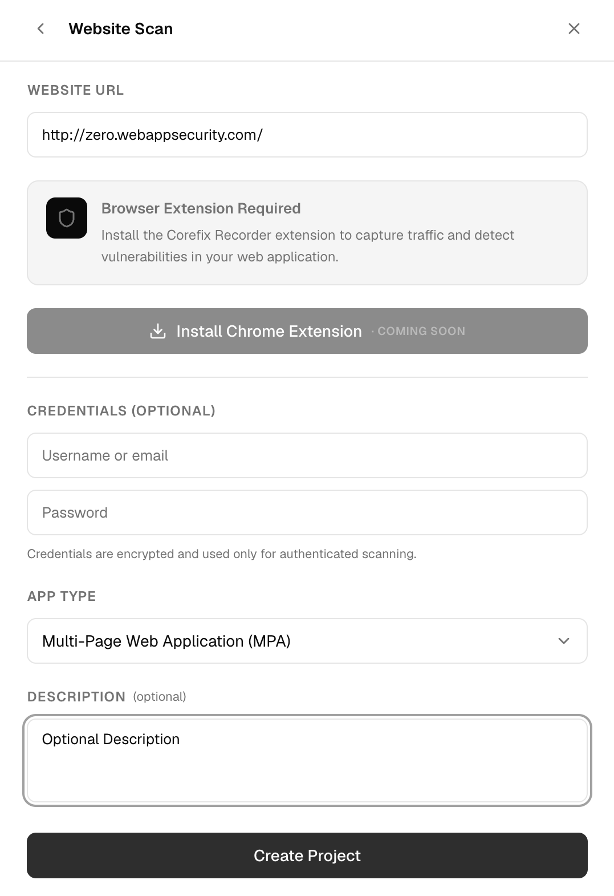
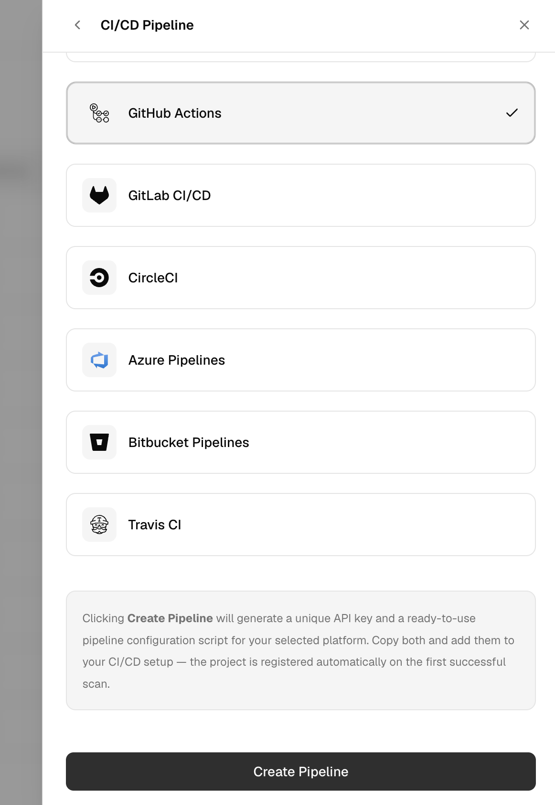
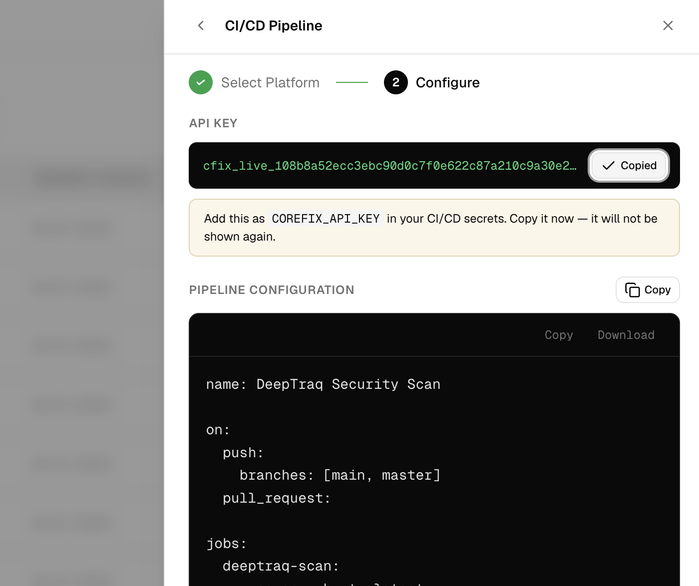

## Creating a Project

Projects are the core unit of organization in CoreFix. Each project maps to either a web application or a code repository and holds all scan results, settings, and access controls for that target.

To get started, go to Projects and click the + (Plus) icon in the top toolbar.

Select the type of project you want to create.

CoreFix supports three ways to create a project — Web Application, Code Repository, and CI/CD Pipeline — each described in the sections below.

---

## Web Application Project

Use this when your target is a live web application accessible via URL.

1. Go to **Projects** and click the **+ (Plus) icon** in the top toolbar.
2. Select **Website Scan**.
3. Fill in the project details:

| Field | Required | Description |
|---|---|---|
| **URL** | Yes | Full URL of the web application (e.g. `https://app.example.com`) |
| **App Type** | No | Architecture of the application (see below) |
| **Credentials** | No | Username and password for authenticated scanning |
| **Description** | No | Optional label for the project |

> **Note:** Email sharing and scan schedule are configured after project creation via **Project Settings**.

**App Types**

| Value | Use when… |
|---|---|
| **SPA** | Single Page Application — React, Vue, Angular, etc. |
| **HTML** | Traditional multi-page server-rendered site |
| **Legacy** | Complex or non-standard application structure |
| **API** | REST or GraphQL API endpoint |

4. Click **Create Project**.

The project name is automatically derived from the hostname of the URL (e.g. `app.example.com`). On creation, a **report password** and **project URL** are generated — **save the password immediately** as it is shown only once and is not stored in recoverable form.

---

## Code Repository Project

Use this to connect a Git repository for source-code security scanning.

1. Go to **Projects** and click the **+ (Plus) icon**.
2. Select **Code Scan**.
3. Click your Git provider to begin the OAuth integration:

| Provider | Status |
|---|---|
| **GitHub** | Supported |
| **GitLab** | Coming soon |
| **Bitbucket** | Coming soon |
| **Azure DevOps** | Coming soon |

4. You will be redirected to the provider's OAuth authorization page. Grant access to the repositories you want to connect.
5. Once authorized, CoreFix redirects you back and automatically creates a project for each connected repository.

> **Currently, only GitHub is supported.** GitLab, Bitbucket, and Azure DevOps integrations are in progress.

### GitHub App (Zero Setup)

The fastest way to connect a GitHub repository — no manual project creation needed.

1. Click the **GitHub icon** in the top navigation bar (right side, aligned with the search bar).

2. Authorize the CoreFix GitHub App.
3. Select your **owner or organization**.
4. Select the **repository** to connect.
5. Click **Install**.

CoreFix redirects you back to the Projects page with the repository already listed. Each connected repository gets its own project and report password, sent to the organization's primary email automatically.

> If a repository is reconnected after the app is reinstalled, the existing project record is updated rather than duplicated.

---

## CI/CD Pipeline Project

Use this to integrate CoreFix into an existing CI/CD pipeline. Scan results are pushed to CoreFix each time the pipeline runs.

1. Go to **Projects** and click the **+ (Plus) icon**.
2. Select **CI/CD Pipeline**.
3. Choose your pipeline platform:

| Platform | Status |
|---|---|
| **GitHub Actions** | Supported |
| **GitLab Runner** | Supported |
| **Jenkins** | Supported |
| **Circle CI** | Supported |
| **Azure DevOps Pipelines** | Coming soon |
| **Bitbucket Pipelines** | Coming soon |
| **Travis CI** | Coming soon |

4. Click **Create Pipeline**.

CoreFix generates a unique **API key** and a ready-to-use **pipeline script** for your chosen platform. You can either:

- **Copy the full script** as a new file to add to your repository, or
- **Copy the job step** and paste it into your existing pipeline configuration.

> **Important:** The API key is shown only once — copy and store it securely before closing this screen.

### Projects Only Appear After the First Pipeline Run

> CI/CD pipeline projects are **not visible in the Projects list until the pipeline runs for the first time** and pushes scan results to CoreFix. Once your pipeline executes successfully, the project will appear automatically with the first set of findings.

---

## Plan Limits

CoreFix does not currently enforce any limits on the number of code repositories or web application projects. Create as many projects as you need.

> Plan-based limits will be introduced in a future release once billing and subscription plans are available.

