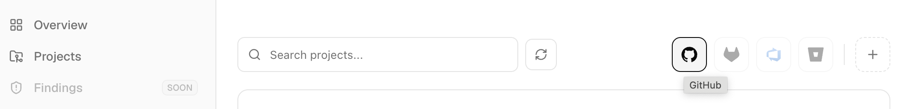
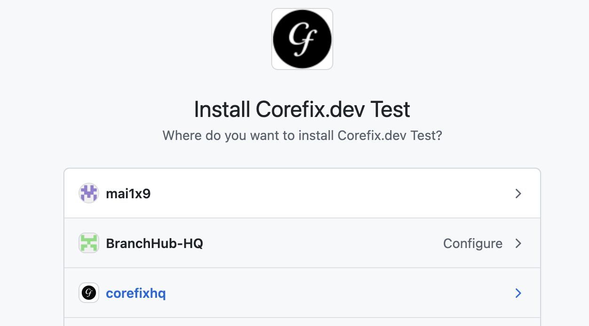

## GitHub Integration — Your First Code Scan

CoreFix integrates directly with GitHub with zero configuration. One click connects your repository and your first scan runs automatically.

By the end of this guide you will:

- Connect a GitHub repository to CoreFix
- Run your first code scan
- Review security findings in the dashboard

---

## Connect Your GitHub Repository

1. After signing in, look for the **GitHub icon** in the top navigation bar (right side, aligned with the search bar).

2. Click the icon — this opens the **GitHub App authorization flow**.
3. Select the **owner or organization** whose repositories you want to connect.
4. Select **any one repository** to install the app on.

5. Click **Install**.

CoreFix redirects you back to the Projects page. Your connected GitHub repository will appear in the list automatically.

---

## Run Your First Scan

1. On the Projects page, locate your newly added repository.
2. Click the **Run** button.

That's it. CoreFix launches all code scanners against your repository immediately. Results will be ready in a few minutes.

---

## What Gets Scanned

CoreFix runs the following open source scanners against your codebase in parallel:

| Scanner | What It Finds |
|---|---|
| **OpenGrep** | Injection flaws, insecure patterns, hardcoded credentials, logic bugs (SAST) |
| **Gitleaks** | Hardcoded secrets, API keys, tokens across full git history |
| **OSV-Scanner** | Known vulnerabilities in open source dependencies (SCA) |
| **KICS** | Misconfigurations in Terraform, CloudFormation, Dockerfiles, Kubernetes manifests |
| **Kubescape** | Kubernetes RBAC, network policy, and pod security issues |

All findings are passed through an AI enrichment layer that deduplicates, enriches, correlates across scanners, and prioritizes results before surfacing them to you.

---

## Automatic Scanning on Every PR and Push

Once the GitHub App is installed, CoreFix can automatically trigger a full scan on every pull request or push to a configured branch. To enable and configure these triggers, go to your **Project Settings**.

Refer to [Project Settings](./managing-projects.md) to learn more.

---

## Viewing Results

Once the scan completes:

- Results are available directly in the **CoreFix dashboard** under your project.
- An **email notification** is sent with a link to the HTML report.
- The HTML report is publicly accessible for **1 hour** via a time-limited link.
- Your project's full results are available at a **password-protected project link** any time.
