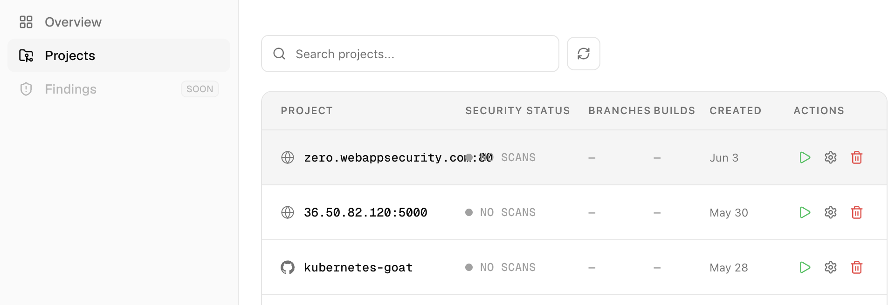
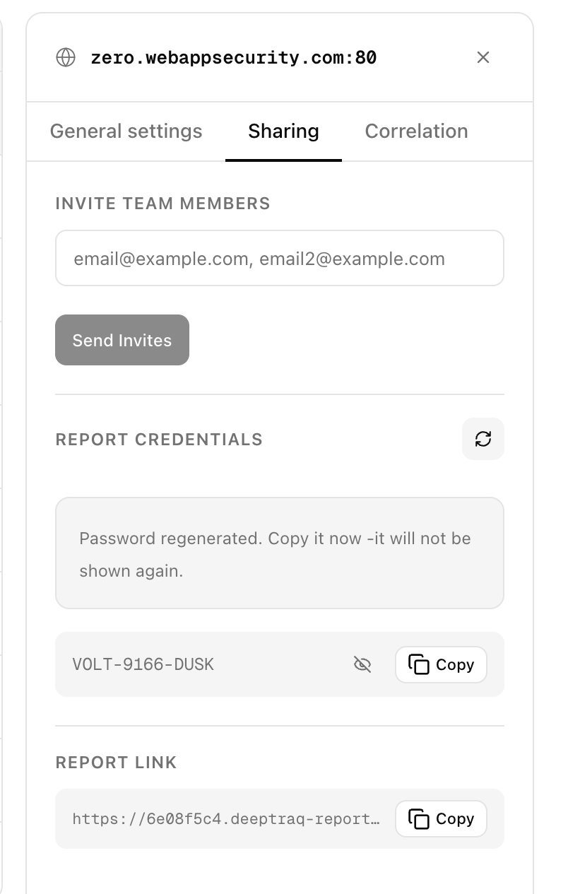

## Managing Projects

This guide covers running scans, configuring project settings, and deleting projects.



Each project row in the Projects list has three action icons on the right side — **Settings**, **Run**, and **Delete** — giving you quick access to all project actions without opening the project.


---

## Running a Scan Manually


To trigger a scan at any time, go to **Projects** and click the green **Run** icon at the far right of the project row.

For **web application** projects, the scan starts immediately.

For **code** projects, a popup appears asking you to select a branch. Each branch runs as an independent job, so you can launch scans on multiple branches in parallel.

> If a scan is already running for a project or branch, triggering another run will return an error. Wait for the current scan to complete before running again.

CoreFix launches all applicable scanners immediately. Results are typically ready within a few minutes, after which you will receive an email notification with the report.

---

## Project Settings

To open settings for a project, click on the project card and navigate to **Project Settings**.

---

### Scan Schedule

Controls how often CoreFix automatically runs a scan on the project. Choose a frequency that matches how actively the project is being developed.

| Schedule | Runs |
|---|---|
| **Manual** | No automatic scans — triggered only via the Run button or CI/CD |
| **Daily** | Once every day |
| **Weekly** | Once every 7 days |
| **Biweekly** | Once every 14 days |
| **Monthly** | Once per calendar month |
| **Quarterly** | Once every three months |
| **Custom** | On a cron expression you define |

All scheduled scans fire relative to the time the setting was saved. For example, if you save a **Weekly** schedule on a Tuesday at 11:00 AM, the next scan runs the following Tuesday at 11:00 AM, and every Tuesday after that.

#### Schedule Examples

**Daily**
> Saved: Monday, Jun 9 at 11:00 AM
> Next run: Tuesday, Jun 10 at 11:00 AM
> Then: every day at 11:00 AM

Good for actively developed projects or staging environments where you want continuous visibility.

---

**Weekly**
> Saved: Monday, Jun 9 at 11:00 AM
> Next run: Monday, Jun 16 at 11:00 AM
> Then: every Monday at 11:00 AM

A sensible default for most projects — balances coverage with scan usage.

---

**Biweekly**
> Saved: Monday, Jun 9 at 11:00 AM
> Next run: Monday, Jun 23 at 11:00 AM
> Then: every 14 days

Good for projects with slower release cadences or lower-risk surfaces.

---

**Monthly**
> Saved: Monday, Jun 9 at 11:00 AM
> Next run: Wednesday, Jul 9 at 11:00 AM
> Then: on the 9th of each month

Suitable for stable applications that change infrequently.

---

**Custom (Cron)**

Enter any standard 5-field cron expression for full control over the schedule.

```
┌───────── minute (0–59)
│ ┌─────── hour (0–23)
│ │ ┌───── day of month (1–31)
│ │ │ ┌─── month (1–12)
│ │ │ │ ┌─ day of week (0–6, Sun=0)
│ │ │ │ │
* * * * *
```

**Common examples:**

| Expression | Meaning |
|---|---|
| `0 9 * * 1` | Every Monday at 9:00 AM |
| `0 0 * * *` | Every day at midnight |
| `0 8 1 * *` | First day of every month at 8:00 AM |
| `*/30 * * * *` | Every 30 minutes |
| `0 6 * * 1,3,5` | Every Monday, Wednesday, Friday at 6:00 AM |

> **Example:** Setting `0 9 * * 1` on Jun 9 at 11:00 AM → next run fires Monday Jun 16 at 9:00 AM, then every Monday at 9:00 AM after that.

---

### PR and Push Triggers (GitHub Integration)

For projects connected via the GitHub App, CoreFix can automatically trigger scans based on GitHub events. These triggers are configured in **Project Settings**.

Three trigger types are available:

- **Scan on every new PR opened** — triggers a full scan whenever a new pull request is opened against the repository.
- **Scan when a PR is synchronised** — triggers a scan each time new commits are pushed to an existing open pull request.
- **Scan on code push** — triggers a scan on pushes to specific branches. You can define branch patterns using regex, such as `main`, `develop`, `release*`, or `feature*`. If no pattern is specified, CoreFix defaults to scanning the `main` branch.

> **Note:** PR and push triggers are available only for code projects connected via the GitHub App integration.

---

### Email Sharing

Add email addresses to share report access with your team.

- The list you provide **replaces** the existing list entirely — include all addresses you want to have access.
- Up to **20** recipients are supported.
- When new addresses are added, the report password is automatically rotated and a new password email is sent to all recipients.

> **Note:** Rotating the password immediately invalidates the old one. Anyone using the old link will need the new password.

---

### Regenerating the Report Password

Each project has a **one-time generated report password** that protects the password-protected project results link. This password is shown only once at project creation — CoreFix does not store it in plain text, only a hash. **Save it immediately when the project is created.**

Clicking **Regenerate Password** in Project Settings generates a new password and instantly invalidates the old one. **No automatic email is sent** — you must manually copy the new password and share it with all stakeholders who need access to the report.

This is useful in situations such as:

- A team member has left and you want to revoke their access
- The password was shared beyond the intended audience
- You are rotating credentials after a security incident

**Adding new users via Email IDs** does not automatically share the password with them either — since the password is never stored in recoverable form, you must share it manually with any new recipients.

> **Tip:** The report password feature is designed for sharing scan results with management, third-party auditors, or external stakeholders who do not need a CoreFix account. They can view the full report directly via the project link using just the password — no sign-up required.



---

### Correlation

> Correlation is available for **web application projects**. 

It links a web project to one of your existing code repository projects, so that findings from both scans are combined and cross-referenced in a single report — giving you a unified view of vulnerabilities across your live application and its underlying source code.

To set up correlation, select the code repository from the **Source Code** projects dropdown, then specify the branch pattern to correlate against (e.g. `main`, `develop`, `test*`).

Set correlation to **None** to remove an existing link.

---

## Deleting a Project

To permanently delete a project:

1. Go to **Projects** and find the project in the list.
2. Click the **Delete icon** at the far right of the project row.
3. Type `delete` in the confirmation box to confirm.
4. Click **Delete**.

Deleting a project permanently removes the project record, all scan builds, all findings, and all branch records. **This action cannot be undone.**
