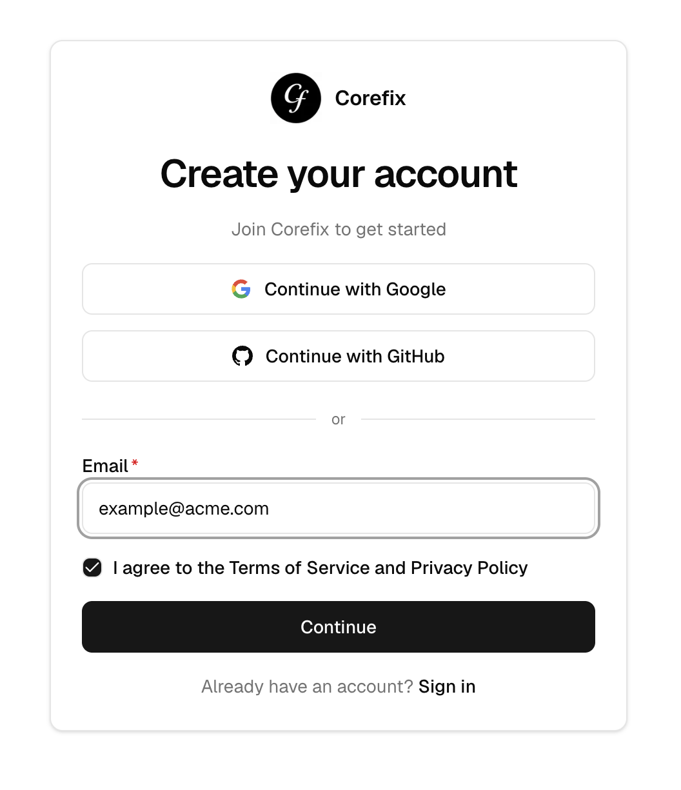
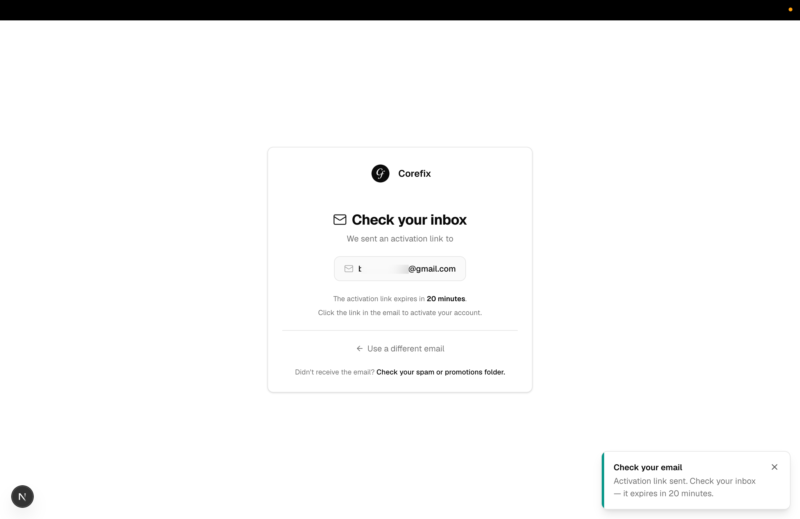
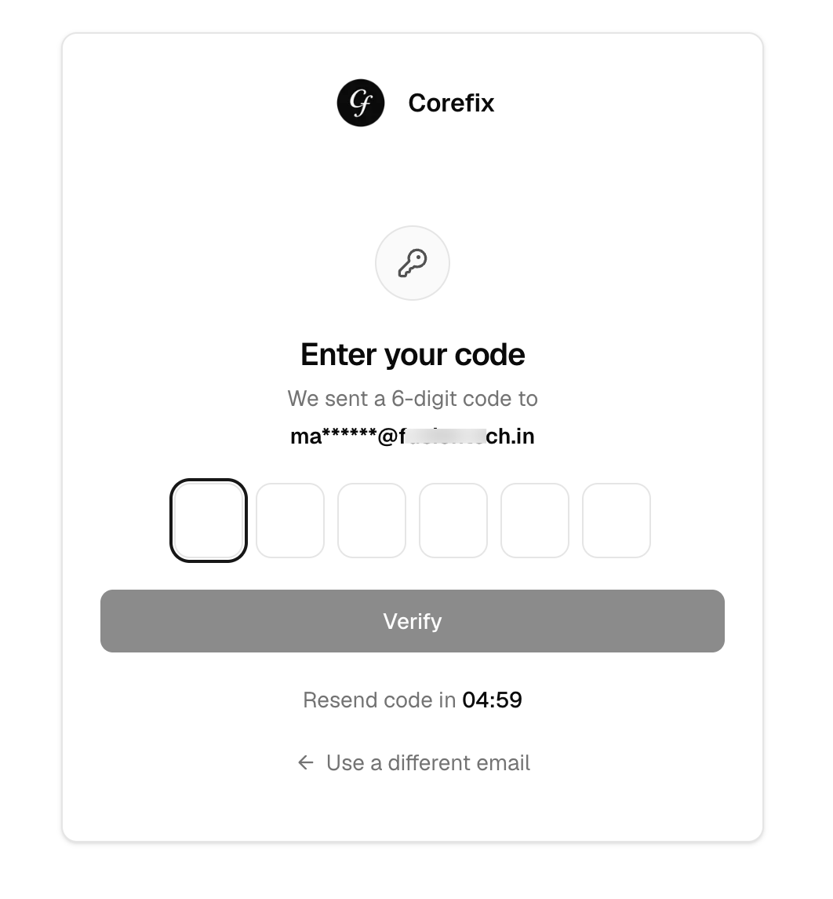

## Sign Up & Sign In

CoreFix is available at:

- **Sign In:** [app.corefix.dev/login](https://app.corefix.dev/login)
- **Sign Up:** [app.corefix.dev/signup](https://app.corefix.dev/signup)

---

## Authentication Options

CoreFix supports three ways to authenticate:

| Method | Sign Up Required | Password | Notes |
|---|---|---|---|
| GitHub OAuth | No | No | One-click, account auto-created on first login |
| Google OAuth | No | No | One-click, account auto-created on first login |
| Custom Email | Yes | No | OTP-based login after signup |

---

## Signing In with GitHub or Google

Click **Continue with GitHub** or **Continue with Google** on the login page.

If no account exists yet, one is automatically created for you — no separate sign-up step needed. You will land directly into the CoreFix dashboard.

---

## Signing Up with a Custom Email

1. Go to [app.corefix.dev/signup](https://app.corefix.dev/signup).

2. Enter your email address and accept the Terms of Service.
3. An **activation link** will be sent to your email.

4. Click the link to verify your address — you will be taken into the CoreFix dashboard.

> **Note:** If you try to log in with a custom email that has not been signed up, login will not work. You must complete signup first.

### Logging In After Signup (Custom Email)

1. Go to [app.corefix.dev/login](https://app.corefix.dev/login).
2. Enter your email address.
3. A **one-time password (OTP)** will be sent to your email.

4. Enter the OTP to access your account.

No password is required — CoreFix uses magic OTP login for custom email accounts.

> **Note:** GitHub and Google OAuth users will not receive a magic link or OTP. Authentication is handled entirely through the respective OAuth provider.
