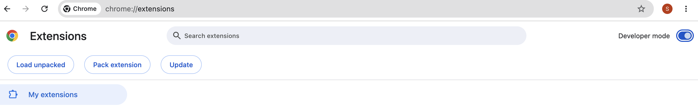
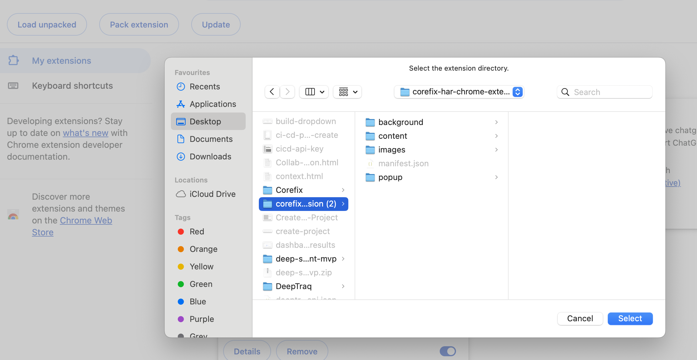

# CoreFix Chrome Extension - User Guide


## Overview

The CoreFix Chrome Extension records an authorized browser workflow and uploads HAR (HTTP Archive) chunks to CoreFix secure object storage. A recording helps CoreFix web scanning understand real application traffic, including authenticated and JavaScript-driven flows that a basic crawl may miss.

The recorder captures the selected browser tab only. It does not record your other open tabs.

::: warning Treat recordings as secrets
HAR files can contain sensitive values from the recorded workflow, including form values, passwords, tokens, cookies, request and response bodies, URLs, and browser storage. Record only applications and workflows you are authorized to test. Handle uploaded and downloaded HAR files as secrets.
:::

---

## Prerequisites

Before recording, make sure you have:

- Google Chrome 120 or later
- A CoreFix account and your CoreFix organization ID
- A CoreFix web project registered for the site you want to record
- An email address authorized for that project
- Permission to capture and security-test the target workflow

The extension uses the hostname from your active tab to find the matching CoreFix project. For example, opening `https://app.example.com/login` associates the sign-in request with the `app.example.com` project.

---

## 1. Install the Extension

### Chrome Web Store installation (recommended)

 **[Corefix Security Recorder](https://chromewebstore.google.com/detail/corefix-security-recorder/chibaoiobkclhiieocggohhofcmcejgi)**

The extension is published and available on the Chrome Web Store. Open the link above, then select **Add to Chrome** and confirm **Add Extension**.

### Install an unpacked package (manual)

If you prefer to install manually, or need a specific build:

1. Download the extension package: [Corefix Har Chrome Extension](https://static-assets.corefix.dev/corefix-har-chrome-extension.zip)
2. Unzip the package to a local folder.
3. Open Chrome and go to `chrome://extensions`.
4. Enable **Developer mode** in the top-right corner.



5. Click **Load unpacked**.
6. Select the unzipped extension folder containing `manifest.json`.



7. Pin the CoreFix icon from Chrome's extensions menu.


---

## 2. Authenticate with OTP

The extension uses an email OTP. Your CoreFix password is not entered into or stored by the extension.

### Request an OTP

1. Open the target application in an `http://` or `https://` tab.
2. Click the CoreFix extension icon.
3. Enter your email address and organization ID.
4. Click **Send OTP**.

The extension automatically sends the origin of the active tab with the OTP request. The backend matches its hostname to a CoreFix project and checks that your email is authorized.

### Verify the OTP

1. Check your inbox for the six-digit verification code.
2. Enter the code in the extension popup.
3. Click **Verify OTP**.

OTP security limits:

| Limit | Value |
|---|---|
| OTP validity | 10 minutes |
| Maximum OTP attempts | 5 |
| Verified extension session | 2 hours |

After successful verification, the extension stores a project-scoped session token in Chrome extension storage. If the token expires, authenticate again before uploading more HAR data.

---

## 3. Start a Recording

1. Open the page where the workflow should begin.
2. Click the CoreFix extension icon.
3. Optionally enter a **Session Name**. If you leave it empty, the default is `Security Recording`.
4. Click **Start Capture**.
5. Review the consent prompt and allow recording for the selected tab.
6. Approve Chrome's site-access permission prompt if it appears.
7. Use the application normally: navigate pages, sign in, click controls, fill forms, and submit requests.

Chrome requests access to `http://*/*` and `https://*/*` so the recorder can correlate requests made by the selected tab, including traffic sent to API hosts and related origins.

While recording, the popup shows:

- Current state and elapsed recording time
- Captured action, request, and response counts
- The current URL
- The planned HAR export name

### Recording scope

- Capture is tied to the original browser tab where you clicked **Start Capture**.
- Switching to another tab does not record that other tab.
- Closing the original recording tab discards the locally retained recording state.
- If the original tab navigates to a new origin, the state may change to `needs_permission`. Reopen the popup from the original tab and click **Resume** to continue.

---

## 4. Stop, Resume, or Discard

### Stop and upload

When you finish the workflow:

1. Open the CoreFix popup from the original tab.
2. Click **Stop**.
3. Wait for the state to change to `exported`.

Stopping captures the final browser-storage snapshot, finishes pending request correlation, uploads the final HAR remainder, and ends active capture.

### Resume

Click **Resume** when you need to continue the same recording after:

- Stopping the recording
- Returning to an exported recording
- Reaching a new origin that needs recording permission

Resume must happen from the original recording tab.

### Discard

Click **Discard**, then confirm **Yes**, to remove the current locally retained recording state from the extension.

Discarding a recording does not guarantee deletion of chunks that were already uploaded to CoreFix secure object storage.

---

## 5. What the Extension Captures

Each upload is a HAR 1.2 JSON document. Standard HAR entries contain network traffic. CoreFix adds recorder-specific context under `log._deeptraq`.

| Category | Examples |
|---|---|
| Browser actions | Clicks, field fills, chip or token commits, select changes, and navigations |
| Element context | Selectors, labels, placeholders, roles, link targets, and checked state |
| Network requests | URLs, query parameters, methods, headers, text request bodies, resource types, and timing data |
| Network responses | Status codes, headers, eligible text response bodies, network errors, and timing data |
| Session context | Cookies, local storage, session storage, visited origins, viewport, user agent, and frame context |
| CoreFix metadata | Action-to-request correlation, permission summary, capture summary, frame registry, and analysis hints |

Some binary or unsupported response bodies may not appear as text in the HAR file.

The extension does not record:

- Activity from tabs other than the original recording tab
- Screen video or screenshots
- File upload contents selected through file inputs
- Non-browser activity on your device

---

## 6. How Uploads Work

Recordings are uploaded in chunks so longer workflows do not need to wait until the end.

By default, the extension stages and uploads the current HAR segment:

| Trigger | Default behavior |
|---|---|
| Time interval | Every 1 minute while recording |
| Segment size | When the staged HAR reaches 20 MB |
| Stop | Upload the final remainder |

Each recording receives a unique session ID. Every chunk from the same recording uses that ID so CoreFix can group the files.

### Direct upload flow

1. The extension requests an authenticated upload handshake from CoreFix.
2. CoreFix returns a short-lived presigned HTTPS upload URL.
3. The extension uploads the HAR JSON chunk directly to secure object storage with an HTTPS `PUT`.
4. If an upload fails, the pending chunk stays in Chrome extension storage for retry.

::: info Storage implementation note
CoreFix describes this destination as secure object storage in user-facing documentation. The current backend stores extension HAR chunks in Cloudflare R2 using its S3-compatible API and five-minute presigned HTTPS upload URLs.
:::

---

## 7. How HAR Files Are Used

The latest uploaded recording is designed to become authenticated web-scan input automatically for the matching CoreFix project when a web scan runs.

This helps the scanner cover:

- Post-login pages and APIs
- Workflows with session cookies or bearer tokens
- JavaScript-driven requests
- Requests associated with specific user actions

You do not need to select a HAR session in the extension after uploading it. Record the desired workflow, stop the capture successfully, and then run the web scan for the matching project.

---

## 8. Example HAR Output

The shortened example below shows the shape of one uploaded chunk. All values are dummy values.

```json
{
  "log": {
    "version": "1.2",
    "entries": [
      {
        "request": {
          "method": "POST",
          "url": "https://api.example.test/v1/orders",
          "headers": [
            { "name": "authorization", "value": "Bearer dummy-token-for-documentation" }
          ],
          "postData": {
            "mimeType": "application/json",
            "text": "{\"sku\":\"demo-plan\",\"quantity\":1}"
          }
        },
        "response": {
          "status": 201,
          "content": {
            "mimeType": "application/json",
            "text": "{\"success\":true,\"order_id\":\"order_demo_001\"}"
          }
        },
        "_deeptraq": {
          "requestId": "req_demo_001",
          "actionId": "a3",
          "actionType": "click"
        }
      }
    ],
    "_deeptraq": {
      "schemaVersion": "1.1.0",
      "recordingId": "rec_demo_001",
      "session": {
        "cookiesCaptured": true,
        "sensitive": true
      }
    }
  }
}
```

[Download the complete dummy HAR sample](/samples/corefix-extension-har.sample.json)

`_deeptraq` is the current compatibility namespace for CoreFix recorder metadata. Despite the historical namespace name, the data belongs to the CoreFix recording format.

---

## 9. Troubleshooting

| Problem | Likely cause | What to do |
|---|---|---|
| `No project registered for this domain` | The active tab hostname does not match an existing CoreFix web project | Create or run the initial web project scan, then request a new OTP from the matching site |
| `Email not authorized for this project` | Your email is not authorized for the matched project | Ask your CoreFix administrator to add your email to the project |
| OTP email does not arrive | Incorrect email, spam filtering, or delivery delay | Check the entered email and spam folder, then request a new OTP |
| `OTP expired. Request a new one.` | More than 10 minutes passed | Click **Send OTP** again |
| `Too many attempts. Request a new OTP.` | Five invalid OTP attempts were used | Request a fresh OTP |
| Chrome asks for access to all sites | The recorder needs to correlate the selected tab's traffic across related origins | Approve access only if you are authorized to record the workflow |
| State changes to `needs_permission` | The original tab navigated to a new origin | Reopen the popup from the original tab and click **Resume** |
| Upload does not complete | Network connectivity, token expiry, or object-storage upload failure | Reconnect, authenticate again if needed, then reopen the extension so pending uploads can retry |
| Recording disappears after closing a tab | The original recording tab was closed | Start a new recording from the target application |

---

## 10. Security Checklist

- Record only approved applications and workflows.
- Use a test account where possible.
- Avoid recording unrelated personal or production data.
- Treat HAR files as secrets because they may contain working credentials and session state.
- Stop or discard the recording when your intended workflow is complete.
