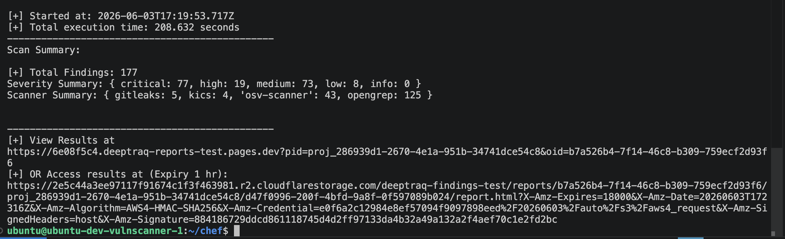

# Code Scanner — Standalone Usage

Run the CoreFix code scanner on any machine with Docker installed using the `corefix` CLI. It runs the `corefixhq/cfix` image for you — no `docker run` commands, volume mounts or environment variables to manage.

Check your installed version with `corefix --version`, and pull the latest scanner images with `corefix update`.

::: tip New Scanners Now Live
- **Container Scanning** - vulnerabilities in your container images
- **CIS Benchmarking** for Dockerfiles
- **Malware & Supply Chain Risk Detection** for packages
- **SonarQube Integration** for security hotspots, code smells, and bugs
- **AI Governance Scanner** and **AI BOM** — AI Bill of Materials and governance scan across source code
- **SBOM Generator** — Software Bill of Materials for your project
:::

---

## Setup

You need [Docker](https://docs.docker.com/get-docker/) running and the `corefix` binary on your `PATH`. See [CoreFix CLI — Overview](./docker-cli) for installation.

### Log in

```bash
corefix login
```

This opens your browser, signs you in to CoreFix, and saves your session to `~/.corefix/session.json`. One login covers both code and web scanning, and you only do it once per machine.

Alternatively, skip the login and export an API key from [Account & API Keys](https://app.corefix.dev/settings/api-keys):

```bash
export CFIX_API_KEY=<your-api-key>
```

`corefix` reads `~/.corefix/session.json` first and falls back to `$CFIX_API_KEY`.

### Update the scanner images

```bash
corefix update
```

Docker Hub: [hub.docker.com/r/corefixhq/cfix](https://hub.docker.com/r/corefixhq/cfix)

---

## Quick Start

Run from the root of the repository you want to scan:

```bash
corefix code
```

That's it — all scanners run against the current checkout, and results are written to `~/.corefix/scan-results` and sent to your CoreFix dashboard.



---

## Full Command Reference

```bash
corefix code [<scanner>[,<scanner>...]] \
  [--openai-api-key <key>] \
  [--model <model-name>] \
  [--ignore-ai-analysis] \
  [--github-token <github-pat>] \
  [--container <images>] \
  [--patch] \
  [--rescan] \
  [--pr] \
  [--in-place]
```

Other commands:

| Command | Description |
|---|---|
| `corefix login` | Log in to CoreFix using your browser. Covers both code and web scanning |
| `corefix code status` | Print the last known scan status (branch, commit and patch state) as JSON |

---

## Authentication and Output

| Item | Description |
|---|---|
| API key | Read from `~/.corefix/session.json` (created by `corefix login`), falling back to the `CFIX_API_KEY` environment variable |
| Source code | `corefix` scans the repository in your current directory. Run it from your repository root |
| Results | Reports are written to `~/.corefix/scan-results` after the scan completes |

### What `corefix code` does for you

You don't pass any Docker flags — `corefix code` sets up the container for you:

- **Runs as your user.** The scanner container always runs with `--user "$(id -u):$(id -g)"`, so files it writes are owned by you rather than root.
- **Mounts `$HOME/.corefix` automatically.** This is how the scanner is authenticated with your `corefix login` session, and where results are written.
- **Mounts the Docker socket only for container scans.** When `--container` is used, `-v /var/run/docker.sock:/var/run/docker.sock` is added so the scanner can access your local Docker daemon and pull images directly — no credentials to your container registry are needed.

---

## Scanners

Pass a comma-separated list as the first argument. Defaults to all scanners if omitted: `osv,iac,secrets,k8s,sast,sonar,container,ai,malware`

| Value | Tool | What it finds |
|---|---|---|
| `sast` | OpenGrep | Code vulnerabilities across 30+ languages |
| `secrets` | Gitleaks | Hardcoded credentials, API keys, tokens |
| `osv` | OSV-Scanner | Dependency CVEs with reachability analysis |
| `iac` | KICS | Terraform, Dockerfile, Helm, CloudFormation misconfigs |
| `k8s` | Kubescape | Kubernetes RBAC, pod security, CIS benchmarks |
| `sonar` | SonarQube | Security hotspot, bug, code smell, and vulnerability rules |
| `container` | CoreFix Container Scanner | Container image vulnerabilities and Dockerfile CIS benchmarking |
| `ai` | AI BOM / AI Governance Scanner | AI Bill of Materials (AI BOM) and AI governance scan across source code |
| `malware` | CoreFix Malware Scanner | Malware within Python, NPM (JS), Golang, Ruby gems, GitHub Actions, and VS Code extensions, plus cross-package supply chain risk detection |

### Automatic SBOM Generation

On your main branch, an SBOM is generated automatically by default — there is no `sbom` scanner to pass yourself.

- A full source-code SBOM is generated from a directory scan of your entire repository.
- If containers are present on the host, passed via `--container`, or tagged `cfix`, a container SBOM is generated automatically for each of those images.
- If the `ai` scanner is included in the run, an AI Bill of Materials (AI BOM) is also generated alongside the source SBOM.

---

## CodeFix — Automated Remediation

CoreFix can patch the vulnerabilities it finds instead of just reporting them. `--patch` runs CodeFix against your findings and writes the fixes into your repository.

::: tip OpenCode Agent Included
CodeFix uses the **OpenCode** coding agent, which ships by default inside the CoreFix Docker image — there is nothing to install or configure. In the future, you will also be able to use your own Claude or Codex as the coding agent.
:::

### Patch options

| Flag | Description |
|---|---|
| `--patch` | Fix the previous pending scan, or scan and fix when no pending scan exists. Free plan: up to 5 patches at a time — see [Patch limits by plan](#patch-limits-by-plan) |
| `--rescan` | Scan the current checkout again; add `--patch` to also fix findings |
| `--pr` | Create a pull request after remediation |
| `--in-place` | Apply fixes directly in the current repository instead of an isolated worktree |

All four default to `false`. Here is what the common combinations do:

| Command | What it does |
|---|---|
| `corefix code` | Scans the current checkout. If a previous scan still has patches pending, it does **not** rescan — it shows the status of that scan instead (see [Scan snapshots and re-runs](#scan-snapshots-and-re-runs)) |
| `corefix code --patch` | Fixes the previous pending scan. If there is no pending scan, scans the current checkout and fixes it |
| `corefix code --rescan` | Scans the current checkout again — a security scan only, no fixes |
| `corefix code --rescan --patch` | Scans the current checkout again and fixes the findings |
| `corefix code --patch --pr` | Fixes the findings, then opens a pull request |
| `corefix code --patch --in-place` | Fixes the findings directly in your current repository instead of an isolated worktree |
| `corefix code status` | Prints the last known scan status (branch, commit and patch state) as JSON |

### How it works

1. Every scan takes a **snapshot** of the current branch and commit. Patches are always applied against that snapshot.
2. `--patch` fixes the previous pending scan. If there is no pending scan, it scans your checkout first and then fixes the findings — so a single command is always enough. Each patch is applied as a commit; how many are applied at a time depends on your [plan](#patch-limits-by-plan).
3. By default, fixes are applied in an **isolated worktree**, so your working directory and current branch are left untouched. Pass `--in-place` to apply the fixes directly in your current repository instead.
4. Optionally, `--pr` opens a pull request after remediation.

```bash
# Fix the previous pending scan (or scan and fix if none is pending)
corefix code --patch

# Scan the current checkout again and fix the findings
corefix code --rescan --patch

# Apply fixes and open a pull request automatically
corefix code --patch --pr --github-token ghp_xxxxxxxxxxxx

# Apply fixes directly in the current repository
corefix code --patch --in-place

# Check the last known scan / patch state
corefix code status
```

> `--pr` requires `--github-token` with write access to the repository, since it pushes the fix branch and opens a pull request. See [`--github-token`](#--github-token-optional) below.

### Patch limits by plan

How much `--patch` can fix in one go depends on your plan.

| Plan | Patches applied at a time | What gets fixed |
|---|---|---|
| **Free** | Up to **5** | Each patch is one commit, and each commit contains a file with all of its vulnerabilities fixed — so up to 5 files are fixed at a time |
| **Pro** | No limit | All issues in all files are fixed in one go |
| **Teams** | No limit | All issues in all files are fixed in one go |

::: warning Free plan
On the Free plan, `--patch` applies at most 5 patches (5 commits) at a time. If more than 5 files have vulnerabilities, the files beyond the limit are not fixed in that run. Upgrade to Pro or Teams to fix every issue across every file in a single run. See [Pricing & Usage](./pricing-and-usage).
:::

### Scan snapshots and re-runs

When you scan, CoreFix takes a snapshot of the **current branch and commit**. If you run `corefix code` again while that scan still has patches pending, it **does not rescan** — it tells you a previous scan exists and how to apply its patches. The patches you are offered always belong to the **old snapshot**, never to code you have changed since.

If you switch branches, or commit new changes on the same branch, CoreFix detects that the checkout has diverged from the scan and tells you what changed. It then suggests `--rescan` to scan the current checkout instead.

**Same branch, same commit** — nothing has changed since the scan:

```
[!] Current checkout: main @ 9244570
[!] Previous scan:   main @ 9244570
[!] Previous scan exists; patch processing is not complete.
[!] Use --patch to apply fixes to the previous scan.
```

**Branch changed, commit unchanged:**

```
[!] Current checkout: bugfix/sql-injection @ 9244570
[!] Previous scan:   main @ 9244570
[!] Branch changed: main -> bugfix/sql-injection.
[!] Previous scan exists; patch processing is not complete.
[!] Use --patch to apply fixes to the previous scan.
[!] Use --rescan --patch to scan and fix the current checkout instead.
[!] Use --rescan only for a security scan.
```

**Branch and commit both changed:**

```
[!] Current checkout: bugfix/sql-injection @ aa5014f
[!] Previous scan:   main @ 9244570
[!] Branch changed: main -> bugfix/sql-injection.
[!] Commit changed: 9244570 -> aa5014f.
[!] Previous scan exists; patch processing is not complete.
[!] Use --patch to apply fixes to the previous scan.
[!] Use --rescan --patch to scan and fix the current checkout instead.
[!] Use --rescan only for a security scan.
```

**Same branch, new commit:**

```
[!] Current checkout: main @ 686cb1b
[!] Previous scan:   main @ 9244570
[!] Commit changed: 9244570 -> 686cb1b.
[!] Previous scan exists; patch processing is not complete.
[!] Use --patch to apply fixes to the previous scan.
[!] Use --rescan --patch to scan and fix the current checkout instead.
[!] Use --rescan only for a security scan.
```

In short:

- `--patch` → fix the **previous** scan's findings.
- `--rescan --patch` → scan the **current** checkout, then fix it.
- `--rescan` (on its own) → scan the current checkout only, with no fixes.

### Patch progress

CoreFix keeps track of patching per scan, so a patch run that is interrupted or only partly applied can be picked up again. Whenever a patch is in progress or partially applied, `corefix code` shows the progress: how many files are fixed, how many failed, and how many remain.

**Applying patches with `--patch`** — the fixes are applied in the previous scan's isolated worktree:

```
[!] Current checkout: demobranch @ 699f436a9c
[!] Previous scan:   demobranch @ 699f436a9c
[!] Applying fixes to the previous scan’s isolated worktree.
```

**Running `--patch` when patching is already in progress or partially applied** — the progress is shown first, then fixes continue to be applied:

```
[!] Current checkout: demobranch @ 699f436a9c
[!] Previous scan:   demobranch @ 699f436a9c
[+] Patch in progress: 2 fixed, 0 failed, 12 remaining of 14 files.
[!] Applying fixes to the previous scan’s isolated worktree.
```

**Running without `--patch` when patching is in progress** — nothing is applied; the progress is shown along with a reminder to use `--patch`:

```
[!] Current checkout: demobranch @ 699f436a9c
[!] Previous scan:   demobranch @ 699f436a9c
[+] Patch in progress: 2 fixed, 0 failed, 12 remaining of 14 files.
[!] Previous scan exists; patch processing is not complete.
[!] Use --patch to apply fixes to the previous scan.
```

The `Patch in progress` line reads `<n> fixed, <n> failed, <n> remaining of <total> files`. If your plan limits how many patches are applied at a time (see [Patch limits by plan](#patch-limits-by-plan)), run `--patch` again to apply fixes to the files that remain.

---

## AI Models

CoreFix automatically selects an AI model for enrichment based on your account. You don't need to configure anything — but you can override if needed.

**If you don't specify a model or API key:**
- Open source plan → a standard model is randomly selected from the open source pool
- Paid plan → a premium model is randomly selected for higher quality enrichment

**If you specify `--model` without `--openai-api-key`:**
- Paid plan → that model is used if supported
- Open source plan → the model flag is silently ignored and a standard model is selected

**If you specify `--openai-api-key`:**
- `--model` is required. The scan will fail without it.
- The specified model is used via your key. You pay your provider directly.
- See [Supported Models →](https://docs.corefix.dev/docs/models) for the full list of models available with BYOK.

```bash
# BYOK — must include --model
--openai-api-key sk-proj-xxxxxxxx --model gpt-5-mini
```

**Models accepted by `--model` for code scans:** `gpt-5-mini`, `gpt-5.4-mini`, `gpt-5.6-luna`, `bedrock:runtime:claude-haiku-4.5`, `claude-haiku-4.5`, `gpt-5`, `gpt-5.4`, `gpt-5.6-terra`, `claude-sonnet-4.6`, `claude-sonnet-5`

**Skip AI analysis entirely:**

Pass `--ignore-ai-analysis` to skip the AI pipeline — this covers deduplication, enrichment of findings, and AI-based prioritization. Raw and normalized findings are still written to `~/.corefix/scan-results`, but no enriched report or AI-based prioritization is generated.

---

## CLI Options

### `--openai-api-key` (optional)

Your own OpenAI API key. Requires `--model`. See [AI Models](#ai-models) above.

### `--model` (optional)

Override the AI model used for enrichment. See [AI Models](#ai-models) for the accepted values and [Supported Models](https://docs.corefix.dev/docs/models).

### `--ignore-ai-analysis` (optional)

Skip the AI pipeline — deduplication, enrichment of findings, and AI-based prioritization are all skipped. Useful for faster runs, or when you only need raw/normalized findings without AI enrichment. Cannot be combined meaningfully with `--openai-api-key` / `--model`, since there is no enrichment step to run those against. Default: `false`.

### `--github-token` (optional)

GitHub Personal Access Token for uploading scan results as a SARIF file to GitHub Code Scanning. Also required for `--pr`.

```bash
--github-token ghp_xxxxxxxxxxxx

# In CI, read it from a secret
--github-token "$GITHUB_TOKEN"
```

### `--container` (optional)

```
--container <names>
  Specify container names for scanning, as a comma-separated list.
  Mounts the host Docker socket so the scanner can read local images.
  Type: string
```

Example — comma-separated image names:

```
nginx,redis:v6.2.0,postgres:latest
```

If `--container` is not passed, the `container` scanner defaults to scanning the first 3 images returned by `docker images` on the host.

You can also opt an image into scanning by tagging it `cfix` — every image with a `cfix` tag is picked up automatically:

```bash
docker tag <YOUR-CONTAINER>:latest cfix
```

### `--patch` (optional)

Fix the previous pending scan, or scan and fix when no pending scan exists. Fixes are applied in an isolated worktree unless `--in-place` is set. Patches always apply to the snapshot (branch and commit) of the previous scan — see [Scan snapshots and re-runs](#scan-snapshots-and-re-runs). On the Free plan, up to 5 patches (5 commits) are applied at a time; Pro and Teams fix all issues in all files in one go — see [Patch limits by plan](#patch-limits-by-plan). Default: `false`.

```bash
--patch
```

### `--rescan` (optional)

Scan the current checkout again; add `--patch` to also fix findings. Use it when CoreFix reports that your branch or commit has changed since the previous scan. On its own, `--rescan` is a security scan only. Default: `false`.

```bash
--rescan --patch
```

### `--pr` (optional)

Create a pull request after remediation. Requires `--github-token` with write access to the repository. Default: `false`.

```bash
--patch --pr
```

### `--in-place` (optional)

Apply fixes directly in the current repository instead of an isolated worktree. Default: `false`.

```bash
--patch --in-place
```

---

## Examples

### All scanners

```bash
corefix code
```

### Specific scanners only

```bash
# Secrets and SAST
corefix code secrets,sast

# Dependencies and IaC only
corefix code osv,iac

# Sonar, AI BOM/Governance, and malware scanning
corefix code sonar,ai,malware
```

### Bring your own API key

```bash
corefix code \
  --openai-api-key sk-proj-xxxxxxxx \
  --model gpt-5-mini
```

### Skip AI analysis

```bash
corefix code --ignore-ai-analysis
```


### Container scanning with `--container`

::: tip Docker Socket Is Mounted for You
When `--container` is used, `corefix` mounts the host Docker socket automatically. This lets the scanner talk to your local Docker daemon to pull/inspect images directly, so it can scan them without needing any credentials to your container registry.
:::

```bash
corefix code container --container nginx,redis:v6.2.0,postgres:latest
```

### Container scanning via the `cfix` tag

```bash
# Tag the images you want scanned
docker tag myapp:latest cfix
docker tag myapp-worker:latest cfix

# Run the container scanner — no --container flag needed,
# every image tagged "cfix" is picked up automatically
corefix code container
```

### Upload results to GitHub Code Scanning

```bash
corefix code --github-token ghp_xxxxxxxxxxxx
```

- Example of Logs showing successful sarif upload.

```
[*] Uploading 51 findings to GitHub...
[*] Repo: chef Branch: main Commit: d1e9ce21e1f7925b9c489aa137ffd57bb788b87f
[+] SARIF accepted. Status URL: https://api.github.com/repos/mai1x9/chef/code-scanning/sarifs/e98d6b64-5f70-11f1-9ac1-06c8a1baee39
[*] SARIF processing status: complete
[+] SARIF processing complete. Errors: []
[+] SARIF uploaded to GitHub Security tab
    https://github.com/mai1x9/chef/security/code-scanning
```


### Full example with all options

```bash
corefix code secrets,sast,osv \
  --github-token ghp_xxxxxxxxxxxx \
  --openai-api-key sk-proj-xxxxxxxx \
  --model gpt-5-mini
```

### Automated remediation with CodeFix

```bash
# Fix the previous pending scan (or scan and fix if none is pending)
corefix code --patch

# Apply fixes and open a pull request
corefix code --patch --pr --github-token ghp_xxxxxxxxxxxx

# Re-scan the current checkout, then fix and open a PR
corefix code --rescan --patch --pr --github-token ghp_xxxxxxxxxxxx
```

### Use in scripts and CI

```bash
export CFIX_API_KEY=<your-api-key>
corefix code --ignore-ai-analysis

# Read the last known scan / patch state as JSON
corefix code status | jq .
```

---

## Related

- [CoreFix CLI — Overview](./docker-cli)
- [Web Scanner — Standalone Usage](./web-agent-usage.md)
- [CI/CD Integration](./cicd-integration)
- [Supported Models](./models)
- [Pricing & Usage](./pricing-and-usage)
