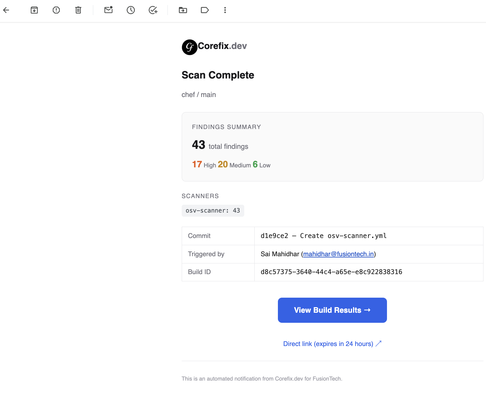
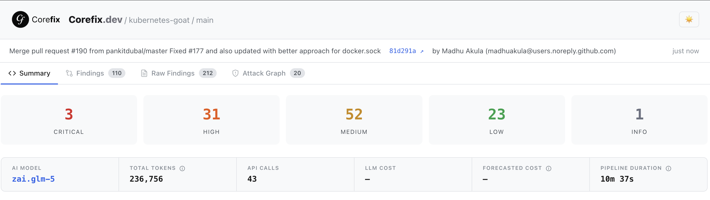
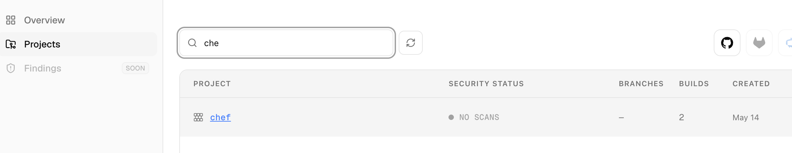
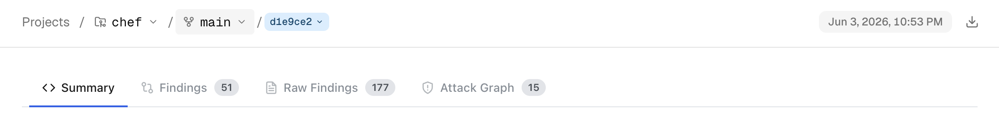
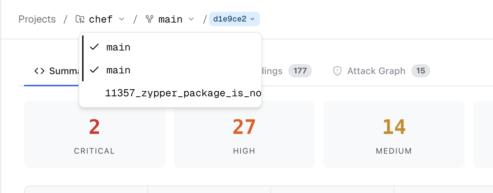
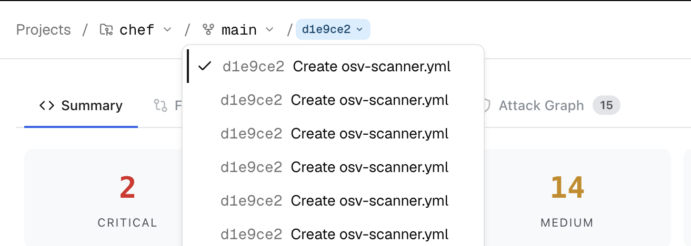
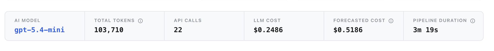
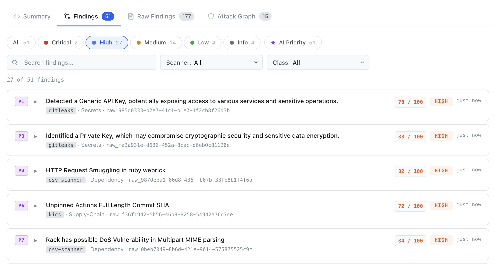
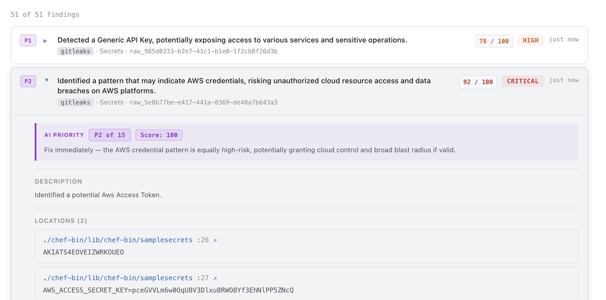

# Security Reports

## Overview

After every scan, CoreFix generates a fully self-contained HTML security report and delivers it to your team. This page explains how to access that report, what each section means, and how AI-enriched findings differ from raw scanner output.

---

## Accessing Your Report

### Email Notification

When a scan completes, every email address configured on the project receives a notification email containing:

- **Severity summary** — counts of Critical, High, Medium, and Low findings at a glance
- **Scanner breakdown** — which scanners ran and how many issues each found
- **Build details** — commit SHA, commit message, who triggered the build, and the build UUID
- **Two links** to the report (see below)



### Option 1 — Login via the Reports Portal

The email contains a **View Build Results →** button that takes you to the Reports Portal pre-filled with your project and organization IDs.

**Login flow:**

1. Enter the email address that received the notification (must be an authorized project member)
2. Enter the project password set by your administrator
3. Your session is valid for **1 hour** — after that you must re-authenticate

Once logged in:

- You see all branches that have builds
- Select a branch to see its last **7 builds**, sorted **newest first**
- Click any build to open the full report

> The session token expires after 1 hour. If the report page stops loading or returns a 401 error, log in again via the Reports Portal.

### Option 2 — Direct Signed URL

The email also contains a **Direct link** below the main button. This is a pre-signed R2 URL that opens the report without any login.

- **Expiry:** 1 hour from the time the email was sent
- After expiry the link returns an error — use the login flow to access the report instead
- The link is scoped to a single build and cannot be used to browse other builds
- Clicking **☀️ / 🌙** toggles between light and dark mode. The preference is saved in your browser.




---

## Projects and Builds

| Concept | What it is |
| ----------- | --------------------------------------------------------------------------------------------------------------------------- |
| **Project** | A repository (Git or web target) tracked in your organization. Identified by `project_id` and `repo` name. |
| **Build** | One scan run against a specific commit and branch. Each build has a unique `build_uuid`. |
| **Branch** | A Git branch (e.g. `main`, `dev`). The portal lets you switch between branches and see each branch's history independently. |

Builds are listed **newest first** (by `created_on` timestamp). The top entry is always the most recent scan.

Click on a project from the Projects list to open it and view its findings, build history, and scan details.



Once inside a project, each build card shows:

- Branch, commit SHA, and commit message
- Who triggered the scan
- Total finding count and severity breakdown
- Scan status


### Header

```
CoreFix / <repo> / <branch> / <build>
```




### Switching Branches and Builds

Use the **branch dropdown in the breadcrumb** to switch between branches and view findings scoped to that branch independently.



Once a branch is selected, use the **build dropdown** to switch between individual scan runs on that branch — useful for comparing findings across commits or revisiting a previous scan.




---

## Inside the Report

Every report shares the same layout:


### Tabs

The report has four tabs. Click any tab to switch; counts in the tab badge update with the current filter.

| Tab              | Contents                                                                                  |
| ---------------- | ----------------------------------------------------------------------------------------- |
| **Summary**      | Severity totals, AI pipeline stats, scanner breakdown, compliance, attack chains overview |
| **Findings**     | AI-enriched findings — prioritized, explained, and classified                             |
| **Raw Findings** | Unprocessed scanner output before AI enrichment                                           |
| **Attack Graph** | Interactive visualization of multi-step attack paths                                      |

---

## Summary Tab

### Severity Cards

Five cards display counts for **Critical · High · Medium · Low · Info**.

Clicking a card jumps directly to the **Findings** tab with that severity pre-selected.

### AI Pipeline Stats

A stats strip shows how the AI enrichment pipeline performed:

| Stat              | Meaning                                                              |
| ----------------- | -------------------------------------------------------------------- |
| AI Model          | The Claude model used for enrichment                                 |
| Total Tokens      | Combined input + output tokens (hover for prompt / completion split) |
| API Calls         | Number of LLM calls made during the build                            |
| LLM Cost          | Actual cost of LLM API usage                                         |
| Forecasted Cost   | LLM cost + estimated Cloudflare Worker time (hover for formula)      |
| Pipeline Duration | Time from scan start to enrichment completion                        |



### Scanner Breakdown

A bar chart showing each scanner's finding count relative to the highest. The longest bar represents the scanner with the most findings.

### Classification

A breakdown of findings by exploit class:

| Class                     | Meaning                                                      |
| ------------------------- | ------------------------------------------------------------ |
| `IMMEDIATELY_EXPLOITABLE` | No prerequisites — attacker can exploit directly             |
| `EXPOSED_SECRETS`         | Credentials, keys, or tokens exposed in code or config       |
| `REACHABLE_VULNS`         | Vulnerable code path reachable from application entry points |
| `LIKELY_FALSE_POSITIVE`   | AI assessed low confidence in the finding                    |
| `UNCLASSIFIED`            | Not enough context to classify                               |

### Compliance Frameworks

Badges for every compliance standard (e.g. OWASP, SOC2, PCI-DSS) that appears in at least one enriched finding.

### Attack Chains Overview

Up to 10 attack chains are listed here with their severity and steps. The full interactive view is on the **Attack Graph** tab.

---

## Findings Tab — Enriched Findings

This is the primary tab for day-to-day triage. Every finding here has been processed by the AI pipeline, which adds context, scoring, and prioritization on top of raw scanner output.

### Filtering

**Severity pills** (row of clickable chips):

`All · ● Critical · ● High · ● Medium · ● Low · ● Info · ★ AI Priority`

- Click a pill to filter by that severity
- Click **★ AI Priority** to show only the top-ranked findings (up to 15 per build)

**Search bar** — full-text search on finding names.

**Scanner dropdown** — filter to a single scanner.

**Class dropdown** — filter by exploit class (`IMMEDIATELY_EXPLOITABLE`, `EXPOSED_SECRETS`, etc.).

The result count at the top of the list updates as you filter: `N of M findings`.

### Finding Cards

Each card shows:

```
[P1]  ▶  <finding name>
         <scanner tag>  ·  <category>  ·  <finding_id>
                                          <risk score>  <SEVERITY>  <time ago>
```





- **P1 … P15** — AI Priority badge (colored by tier: violet > blue > teal > slate). Only top-15 findings have this badge.
- **Risk score** — a 0–100 composite score. Hovering shows a breakdown panel (Exploitability, Impact, Asset Criticality, Exposure, Context).
- **Severity badge** — AI-assessed risk rating: CRITICAL / HIGH / MEDIUM / LOW / INFO.
- Click anywhere on the row to **expand** the full finding detail.

### Expanded Finding Detail

Clicking a card reveals all enriched fields:

| Section                 | Content                                                                                                          |
| ----------------------- | ---------------------------------------------------------------------------------------------------------------- |
| **AI Priority callout** | Shown for top-15 findings. Displays rank (e.g. P3 of 15), composite priority score, and the AI's reasoning note. |
| **Description**         | AI-written explanation of the vulnerability in plain language. Supports inline code, headers, and bullet points. |


